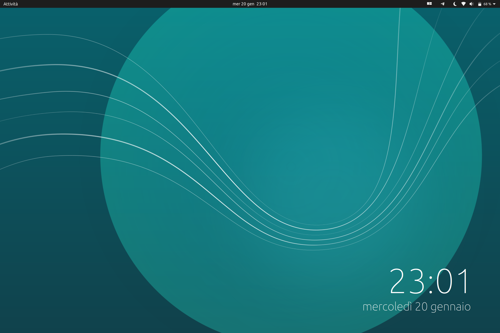
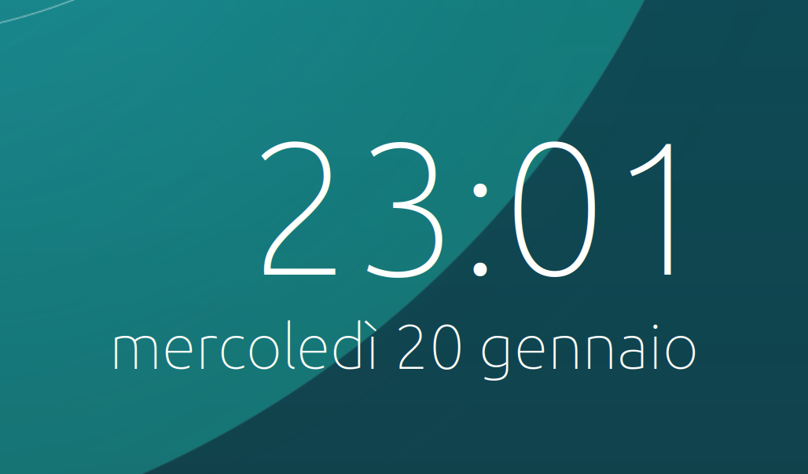

# Conky, Thin Clock

Simple conky configuration inspired from Budgie minimal widget clock.



## Font

First of all, we need the right font. **If you are on Ubuntu, you're just fine.**

Otherwise, you should install the Ubuntu font from [here](https://design.ubuntu.com/font/).



If you are on Arch, you should find the Ubuntu fonts on AUR.

## Installation

Fetch the configuration file `.conkyrc` from the [GitHub repo](https://github.com/mr-chrome/conky-thin-clock):

```
$ git clone https://github.com/gicrisf/conky-thin-clock
```

Then copy the configuration file in your home directory:

```
$ cp ./conky-thin-clock/conkyrc ~/.conkyrc
```

Start conky and enjoy your brand new clock.
